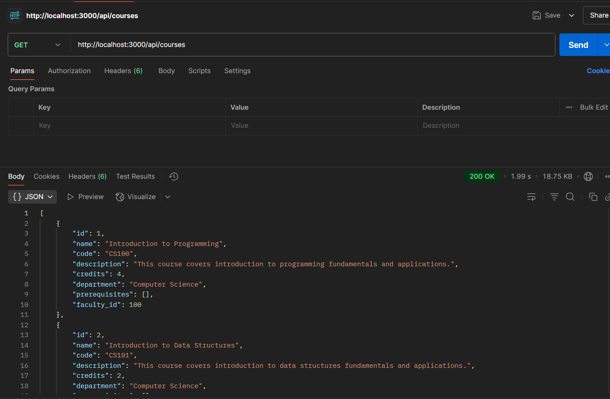
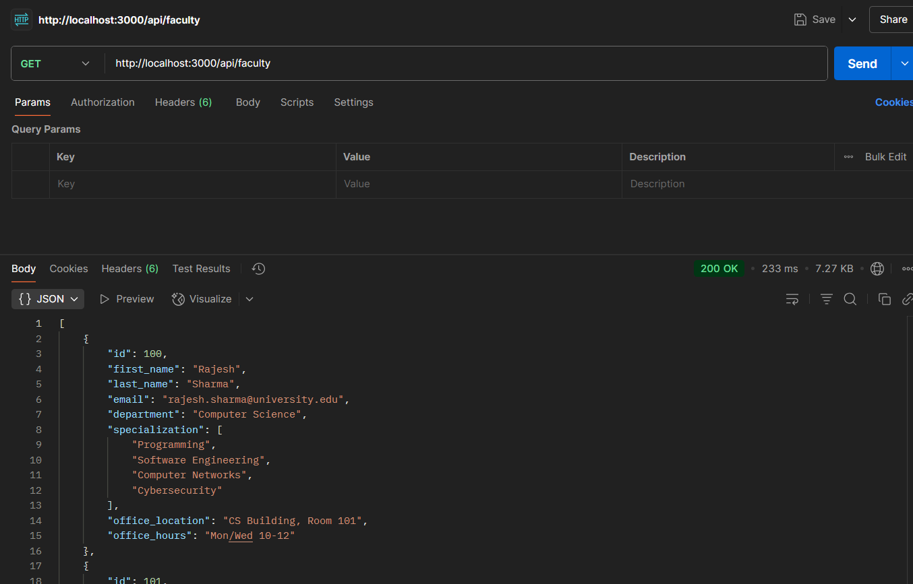
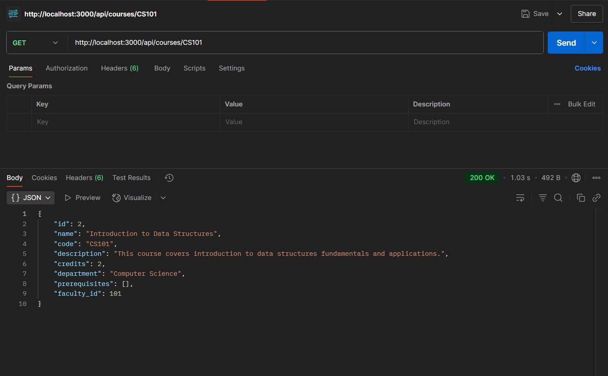
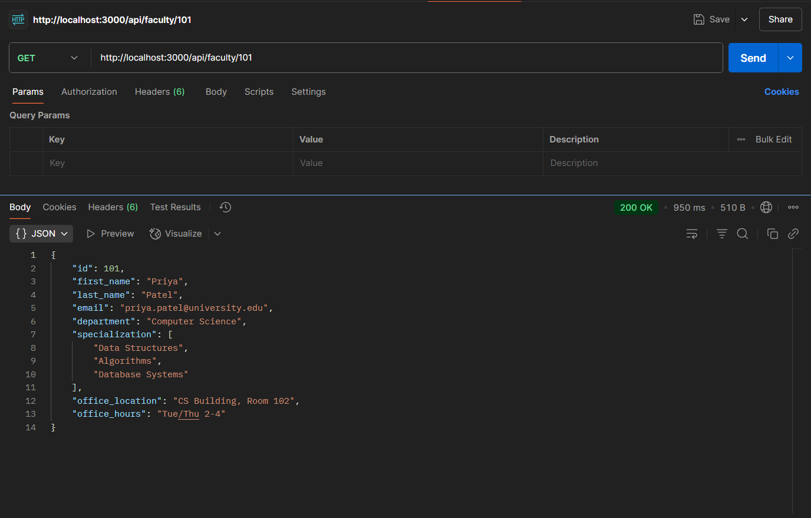

# IIITDM Kancheepuram API Development Challenge Submission

## Overview

This project is a submission for the Day 19 API Development Challenge. It provides a simple RESTful API to access mock data about college courses and faculty members. The API is built using Next.js API routes and uses static JSON files as its data source. There is no database or authentication.

---

## Technology Stack

- **Framework:** Next.js (API routes)
- **Language:** JavaScript (Node.js)
- **Data Storage:** JSON files (in `/data`)

---

## Setup Instructions

1. **Install dependencies:**
   ```bash
   npm install
   ```
2. **Start the development server:**
   ```bash
   npm run dev
   ```
3. **API base URL:**
   - `http://localhost:3000/api/`

---

## Data Model

### Course (`/data/courses.json`)
- `id`: string
- `name`: string
- `code`: string
- `description`: string
- `credits`: number
- `department`: string
- `prerequisites`: array of course IDs
- `faculty_id`: string

### Faculty (`/data/faculty.json`)
- `id`: string
- `first_name`: string
- `last_name`: string
- `email`: string
- `department`: string
- `specialization`: array of strings
- `office_location`: string
- `office_hours`: string

---

## API Endpoints

### Courses
- `GET /api/courses` — List all courses
- `GET /api/courses/[code]` — Get a course by code

### Faculty
- `GET /api/faculty` — List all faculty
- `GET /api/faculty/[id]` — Get a faculty member by ID

---

## Screenshots


### 1. List All Courses


### 2. List All Faculty


### 3. Get Course by Course Code


### 4. Get Faculty by ID


---

## Notes
- All data is mock data, stored in JSON files in the `/data` directory.
- No authentication or write operations are implemented.
- The API is intended for demonstration and testing purposes only.

---

## Testing
- Use Postman or any HTTP client to test the endpoints.
- Example: `GET http://localhost:3000/api/courses`


